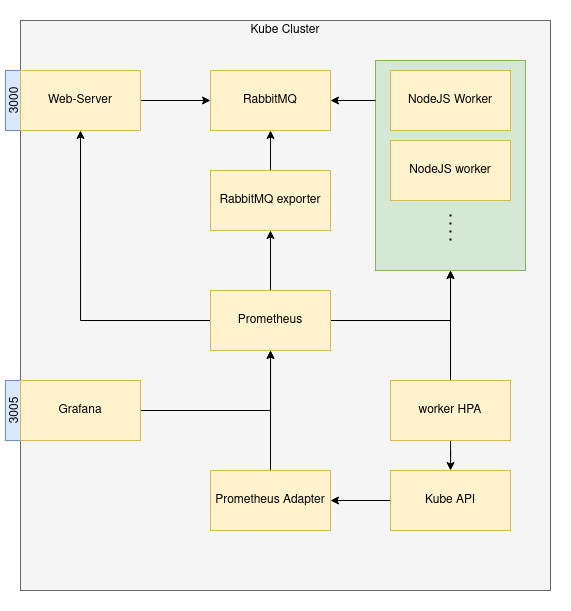

# Kubernetes HPA Scaling
In this project, I try to implement Horizontal Pod Autoscaler[HPA](https://kubernetes.io/docs/tasks/run-application/horizontal-pod-autoscale/) provided by [Kubernetes](https://kubernetes.io/). The Horizontal Pod Autoscaler automatically scales the number of [Pods](https://kubernetes.io/docs/concepts/workloads/pods/) in a [replication controller](https://kubernetes.io/docs/concepts/workloads/controllers/replicationcontroller/), [deployment](https://kubernetes.io/docs/concepts/workloads/controllers/deployment/), [replica set](https://kubernetes.io/docs/concepts/workloads/controllers/replicaset/) or [stateful set](https://kubernetes.io/docs/concepts/workloads/controllers/statefulset/) based on observed CPU utilization (or, with **custom metrics** support, on some other application-provided metrics).

We start by creating a [golang](https://golang.org/) web-server that publishes messages to a [rabbitmq queue](https://www.rabbitmq.com/). These messages are then consumed by a [NodeJS](https://nodejs.org/en/) worker. The worker takes 5s to consume 1 message, representing artificial time to process a request. We then try to scale the worker pods on the basis of the rabbitmq queue length. We'll discuss the entire infra in the upcoming section and role of each part in detail. 

# Demo
<div align="center">

</div>

# Architecture
<div align="center">
    
</div>
<br>

## Web-server
A simple golan server with two routes, one for pushing messages to rabbitmq queue and one for exposing metrics. We are collecting 2 metrics, `http_request_total` and `request_status` to monitor number of request on and status returned by each route respectively. 

### Routes
```
GET /generate    # push message to queue
GET /metrics     # expose metrics for Prometheus server

```

## RabbitMQ
Rabbit MQ is a simple open-source message-broker that can be deployed with ease. The broker has wide support of client libraries across different programming languages. Rabbitmq is widely used in industry and has proven it's mettle. We use Advance Message Queuing Protocol([AMQP](https://www.amqp.org)) as our messaging protocol for both web-server and worker.

## NodeJS Worker
A simple nodejs application that connects to rabbitmq queue anc consumes messages. In order to generate a real life scenario, we take one message at a time and add a delay of 5 sec, representing the time needed to process a message. This way we'll be able to generate fake traffic when we try to run our architecture.

## Prometheus-stack
As discussed above, our goal is to auto-scale by looking at the queue length anf to achieve this we need to add monitoring service to our Cluster. Prometheus is one of the best options available for monitoring tasks. To make things easy and save ourselves from writing manifest files, we'll use helm charts for deployment. We use a [kube-prometheus-stack](https://github.com/prometheus-community/helm-charts/tree/main/charts/kube-prometheus-stack) chart by [prometheus-community](https://github.com/prometheus-community). The chart comes with Prometheus, [Grafana](https://grafana.com/), [Prometheus operator](https://github.com/prometheus-operator/prometheus-operator) and lot of default configurations for these services. Lets look at the role of each component.


   
